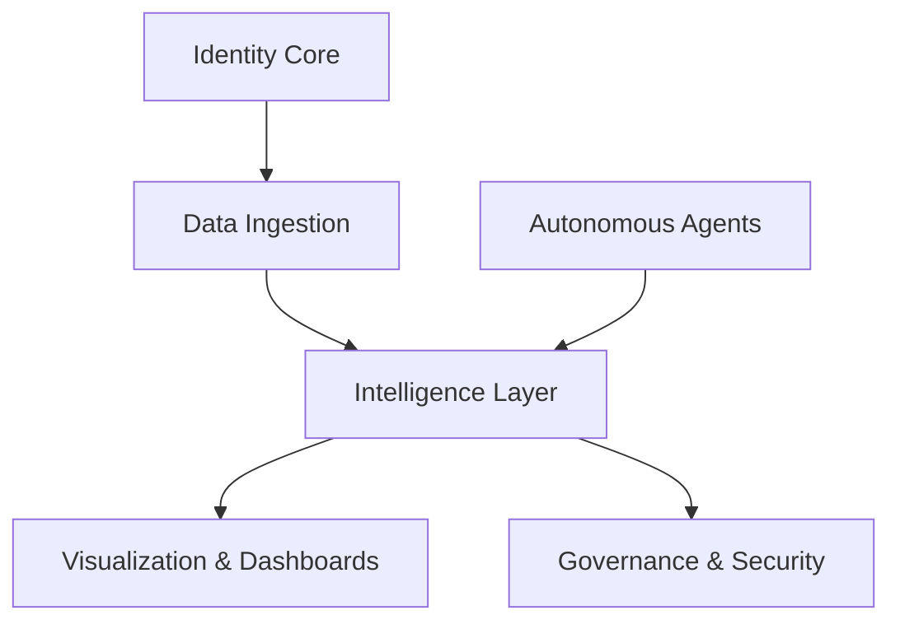
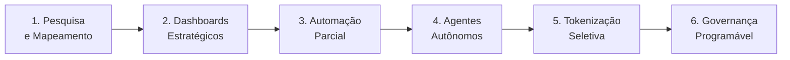

# Strategy Engine · Living System · Infinite Defense

## 1. O que este repositório realmente é

Este repositório não representa um projeto isolado.
Ele representa um **ecossistema em evolução contínua** cujo objetivo é:

- mapear presença digital
- transformar dados em estratégia
- criar vantagem estrutural de longo prazo
- permitir automação progressiva via IA, agentes e blockchain
- sustentar crescimento com defesa infinita

Aqui, estratégia não é opinião.
É **consequência da arquitetura**.

## 2. Princípio Fundador

> Tudo que entra neste sistema deixa rastro.
> Tudo que evolui mantém compatibilidade.
> Tudo que decide pode ser auditado.

Este ecossistema foi desenhado para **nunca precisar ser refeito**, apenas expandido.

## 3. Como Pensar Este Código

Este código não foi organizado por features.
Foi organizado por **núcleos vivos**.

Cada núcleo:

- pode evoluir sozinho
- pode ganhar novos agentes
- pode ser tokenizado futuramente
- não depende de frameworks específicos
- conversa por contratos, não por acoplamento

## 4. Mapa do Ecossistema

**Leitura correta:** Este sistema funciona mesmo sem interação humana constante.

## 5. Núcleos do Sistema

### core/

A fundação imutável.
Configurações, regras globais, enums, exceções.

Nada aqui é feito para mudar rápido.
Mudanças aqui são **decisões estruturais**.

### domains/

Onde a realidade é modelada.

Cada domínio representa uma dimensão do mundo real:

- identidade
- presença web
- presença social
- reputação
- ecossistema de parceiros

Domínios não conhecem frameworks.
Conhecem apenas **significado**.

### ingestion/

A camada de observação.

Aqui vivem coletores, crawlers, buscas e schedulers.
Este núcleo não interpreta, apenas observa e registra sinais.

Quanto mais o tempo passa, mais inteligente ele se torna.

### intelligence/

O cérebro estratégico.

Aqui os dados deixam de ser informação
e passam a ser **vantagem competitiva**.

- Correlação
- Padrões
- Alertas
- Oportunidades
- Riscos
- Narrativas estratégicas

Este núcleo é o primeiro candidato a agentes autônomos.

### visualization/

Onde estratégia vira compreensão.

- Diagramas Mermaid
- Mapas temporais
- Evolução de presença
- Relatórios vivos

Aqui não se "mostra dado".
Aqui se **orienta decisão**.

### identity-access/

Camada de soberania e proteção.

- autenticação via Thirdweb
- embedded wallets
- controle de acesso por estado
- token gating futuro
- proteção progressiva de dados

Aqui nasce a **defesa infinita**.

### governance/

Preparação para o futuro.

- Auditoria
- Permissões
- Tokenização
- Registros imutáveis

Mesmo que não esteja ativo agora,
este núcleo garante que o passado nunca seja perdido.

### agents/

Entidades operacionais.

Agentes não são bots.
São **atores soberanos**.

Cada agente:

- possui identidade
- possui limites
- deixa rastro
- opera 24/7
- pode ser desligado sem quebrar o sistema

## 6. Defesa Infinita

Defesa aqui não é firewall.

Defesa é:

- contratos claros
- fronteiras explícitas
- zero dependência implícita
- permissões contextuais
- auditoria contínua
- agentes com escopo limitado
- possibilidade de tokenização como camada de governança

**Ataques não quebram o sistema.**
**No máximo revelam pontos de evolução.**

## 7. Evolução do Ecossistema

Este repositório foi desenhado para crescer em ondas:

**Nenhuma fase invalida a anterior.**

## 8. Regra Final

Se algo novo for adicionado, deve responder:

1. **Qual núcleo ele pertence?**
2. **Que contrato ele respeita?**
3. **Que rastro deixa?**
4. **Como pode evoluir sem quebrar o sistema?**

> Se não responder, não entra.

---

## Encerramento

Este código não serve apenas para analisar um cliente.
Ele cria um **território estratégico permanente**.

Quem entende este repositório
não pede relatório.
**Pede acesso.**

---

Author: MELLØ // POST-HUMAN

This project follows my personal working standards.
Changes are allowed, inconsistency is not.
