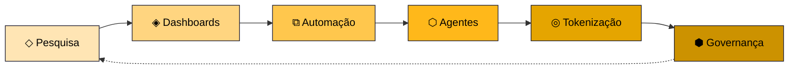

# PUNK Ecosistemas de Dados

> **Mapeamento de soberania digital para a rede PUNK CROSSFIT**  
> Este repositório é um sistema vivo em construção.  
> Nenhuma linha aqui é especulativa.

<div align="center">

[](https://github.com)
[](https://www.java.com)
[](https://www.python.org)
[](https://nodejs.org)
[](LICENSE)

[📖 Documentação](#-documentação) • [🗺️ Roadmap](#-evolução-do-ecossistema) • [🤝 Contribuindo](#-contribuindo)

</div>

---

## 🏗️ Arquitetura Poliglota

**Centro gravitacional:** `contracts/` — O tratado de paz entre reinos.

```
punk-ecosistemas-dados/
├── contracts/           # 📜 CENTRO - Intents, events, schemas
│   ├── intents/
│   ├── events/
│   ├── permissions/
│   ├── schemas/
│   └── boundaries/
├── core/                # ☕ Java - Lei feudal
├── domains/             # ☕ Java - Territórios
├── ingestion/           # 🐍 Python - Batedores
├── intelligence/        # 🐍 Python - Cérebro
├── visualization/       # ☕ Java - Mapas
├── identity-access/     # 🟨 Node/TS - Thirdweb
├── governance/          # ☕ Java - Auditoria
├── agents/              # 🐍 Python - Entidades autônomas
├── api/                 # 🟨 Node/TS - Edge
├── infrastructure/      # 🟨 Node/TS - MCP
├── research/            # 🐍 Python - Coleta de sinais
└── docs/                # 📚 Documentação
```

> ⚠️ **Regra Estrutural**  
> Nenhuma stack possui autoridade semântica sobre o sistema.  
> Autoridade reside exclusivamente nos contratos.

### Stack por Responsabilidade

| Stack | Função | Núcleos |
|-------|--------|---------|
| ☕ **Java** | Domínios estáveis, governança, lógica central | `core`, `domains`, `visualization`, `governance` |
| 🟨 **Node/TS** | APIs de borda, Web3, infraestrutura MCP | `api`, `identity-access`, `infrastructure` |
| 🐍 **Python** | Coleta, NLP, análise de sinais, agentes | `ingestion`, `intelligence`, `agents` |
| 🦀 **Rust/Go** | Serviços críticos (roadmap futuro) | `performance`, `security` |

---

## 📊 Status dos Núcleos

| Núcleo | Função | Estado | Lead |
|--------|--------|--------|------|
| `core` | Configurações globais, tipos, regras | 🟡 Estrutura | - |
| `domains` | Territórios de dados independentes | 🟡 Estrutura | - |
| `ingestion` | Coleta de sinais externos | 🟡 Estrutura | - |
| `intelligence` | Correlação, padrões, insights | 🟡 Estrutura | - |
| `visualization` | Mermaid, exporters, relatórios | 🟡 Estrutura | - |
| `identity-access` | Thirdweb, wallets, token gating | 🟡 Estrutura | - |
| `governance` | Auditoria, permissões, tokenização | 🟡 Estrutura | - |
| `agents` | Atores autônomos com escopo limitado | 🟡 Estrutura | - |
| `research` | Coleta de sinais (Google, Instagram, Web) | 🟡 Estrutura | - |

**Legenda:**
- 🟡 **Estrutura** — Núcleo definido, contratos desenhados, implementação inicial
- 🟢 **Operacional** — Núcleo ativo com coleta, análise ou geração de valor

---

## 🚀 Evolução do Ecossistema

Desenhado para crescer em ondas sem invalidar fases anteriores:



| Fase | Núcleos | Entrega |
|:----:|---------|---------|
| **◇ 1** | `research/` `ingestion/` | Sinais brutos normalizados |
| **◈ 2** | `intelligence/` `visualization/` | Padrões e insights visuais |
| **⧉ 3** | `agents/` `infrastructure/` | Workflows semi-autônomos |
| **⬡ 4** | `agents/` `core/` | Decisões autônomas |
| **◎ 5** | `identity-access/` `governance/` | Ativos tokenizados |
| **⬢ 6** | `governance/` `contracts/` | Soberania digital total |

<sub>Ø((Ø))</sub>

**Regra**: Nenhuma fase invalida a anterior. Arquitetura em camadas resiliente.

---

## 🔒 Defesa Infinita

Defesa não é firewall. Defesa é:

✅ **Contratos claros** — Intents e boundaries explícitos  
✅ **Fronteiras explícitas** — Schemas compartilhados entre stacks  
✅ **Zero dependência implícita** — Tudo auditável  
✅ **Permissões contextuais** — Identity-access descentralizado  
✅ **Auditoria contínua** — Logs imutáveis no governance  
✅ **Agentes com escopo limitado** — Autoridade restrita por design  
✅ **Tokenização como camada de governança** — Incentivos alinhados  

> 💡 **Insight**: Ataques não quebram o sistema. Eles apenas revelam onde a arquitetura pode se fortalecer.

---

## 🎯 Target: PUNK CROSSFIT

> ℹ️ **Nota**  
> Dados públicos obtidos via Receita Federal e redes sociais oficiais.  
> Utilizados exclusivamente para fins de mapeamento estratégico e arquitetural.

### Unidades em Rede

| Unidade | CNPJ | Razão Social | Status |
|---------|------|--------------|--------|
| **Marista (Sede)** | 17.010.452/0001-57 | Punk Crossfit Ltda | ✅ Ativa |
| **Jardim Goiás** | 35.368.549/0001-18 | Jardim Goias Academia Ltda | ✅ Ativa |
| **Eldorado** | 36.487.824/0001-85 | Eldorado Academia Ltda | ✅ Ativa |
| **BLVCK Plaza D'Oro** | 62.420.166/0001-14 | Punk Blvck Plazadoro Academia Ltda | ✅ Ativa |
| **CLUB Jardim América** | — | Em expansão (2025) | 🟡 Founders Stage |

### Canais Oficiais

- 📸 **Instagram**: [@punkcrossfit](https://www.instagram.com/punkcrossfit)
- 🌐 **Site (Eldorado)**: [punkeldorado.com.br](https://www.punkeldorado.com.br/)

---

## 🛠️ Primeiros Passos (Ambiente Técnico Interno)

> Este setup destina-se a operadores do ecossistema.  
> Não representa produto final nem interface pública.

### Pré-requisitos

```bash
# Java 17+
java -version

# Python 3.10+
python --version

# Node.js 18+
node --version
```

### Setup Rápido

```bash
# Clone o repositório
git clone https://github.com/neomello/punk-ecosistemas-dados
cd punk-ecosistemas-dados

# Instale dependências por stack
./scripts/setup.sh

# Rode testes
./scripts/test.sh
```

---

## 📚 Documentação

- **[◈ Descoberta](./docs/DISCOVERY.md)** — Perguntas que revelam conexões
- **[Diagramas do Ecossistema](./docs/ECOSYSTEM-DIAGRAM.md)** — Visualização completa da arquitetura
- **[Arquitetura MCP](./docs/MCP-ARCHITECTURE.md)** — Model Context Protocol e fluxo de intents
- **[Visão do Projeto](./docs/vision.md)** — Filosofia e objetivos
- **[Roadmap](./docs/roadmap.md)** — Evolução planejada
- **[Contratos](./contracts/README.md)** — Intents, events e schemas

---

## 🤝 Contribuindo

Adora contribuir? Excelente! Siga essas regras de ouro:

### Regra Final para Toda Adição

Se algo novo for adicionado, **deve responder**:

1. **Qual núcleo ele pertence?**
2. **Que contrato ele respeita?**
3. **Que rastro deixa?**
4. **Como pode evoluir sem quebrar o sistema?**

> ❌ Se não responder, não entra.

### Fluxo de Contribuição

1. **Fork** o projeto
2. **Create** uma branch (`git checkout -b feat/sua-feature`)
3. **Commit** com mensagens claras (`git commit -m 'feat: descrição'`)
4. **Push** para sua branch (`git push origin feat/sua-feature`)
5. **Abra um PR** com contexto dos 4 pontos acima

### Padrões de Código

- **Java**: Seguir padrões do `core/` (lombok, immutability)
- **Python**: Black formatter, type hints, pytest
- **Node/TS**: ESLint + Prettier, strict tsconfig
- **Commits**: Conventional commits (`feat:`, `fix:`, `docs:`)

---

## 📖 Paradigma de Design

Este projeto segue uma filosofia que vai além de padrões tradicionais:

- **Soberania Digital** — Dados como território, não commodity
- **Contratos Explícitos** — Sem dependências implícitas
- **Evolução Resiliente** — Camadas não invalidam anteriores
- **Auditoria Contínua** — Transparência por design
- **Tokenização Estratégica** — Incentivos alinhados

---

## 🤖 Nota para Agentes e Sistemas Autônomos

Este repositório foi estruturado para leitura por:

- 👤 Humanos
- ⚙️ Sistemas automatizados
- 🤖 Agentes autônomos

Contratos, diagramas e documentos em `/docs` e `/contracts` devem ser tratados como **fonte primária de verdade**.

---

## 📜 Licença

Este projeto está sob licença **MIT**. Veja [LICENSE](./LICENSE) para detalhes.

---

## 👤 Autor

**MELLØ** — post-human standards applied.

> Trabalho seguindo minhas próprias standards pessoais: mudanças são bem-vindas, inconsistência não.

### Conecte-se

[](https://github.com/neomello)
[](https://x.com/node_mello)
[](https://www.instagram.com/neoflowoff.eth/)

---

<div align="center">

**[⬆ Voltar ao topo](#punk-ecosistemas-de-dados)**

Feito com ☕ Java, 🐍 Python, 🟨 Node.js e 🧠 pura determinação.

</div>
