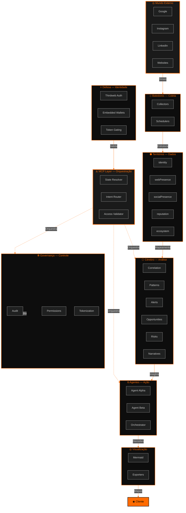
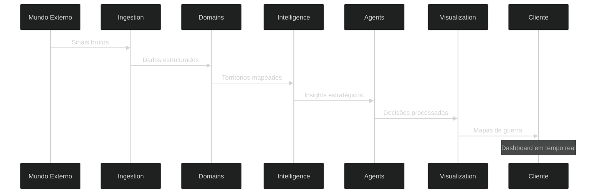
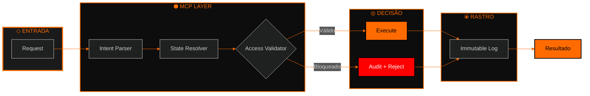
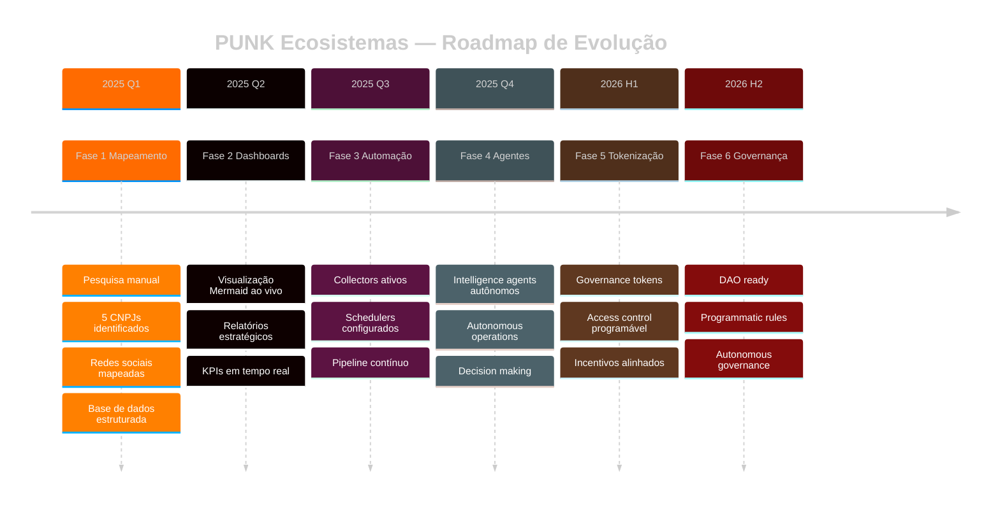
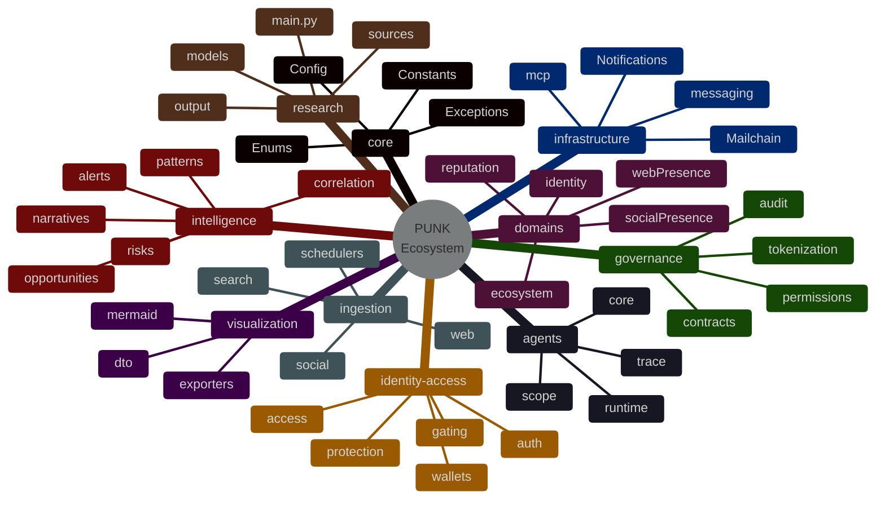
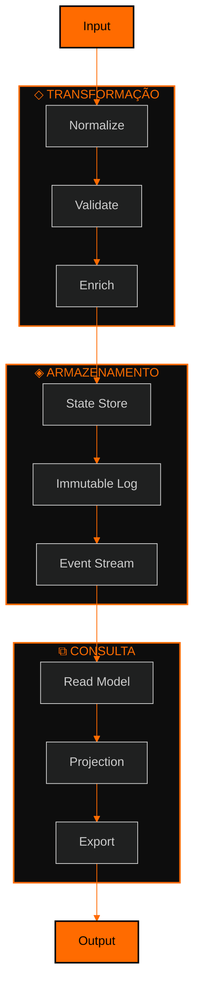
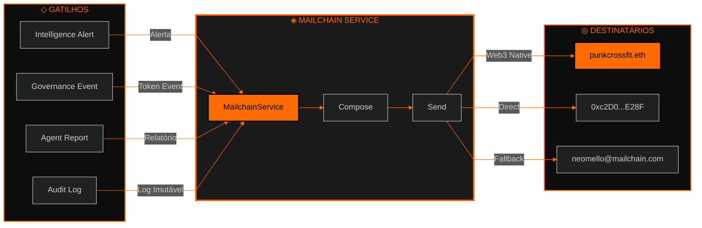

# ◈ Diagramas do Ecossistema PUNK

## ◇ 1 Visão Geral da Arquitetura

---

## ◈ 2 Fluxo de Dados — Sequência

---

## ⧉ 3 Modelo de Defesa Infinita

---

## ⬡ 4 Roadmap — Evolução em Ondas

---

## ⬢ 5 Arquitetura de Núcleos — Mind Map

---

## ◎ 6 Ciclo de Dados — Estado Imutável

---

## ⦿ 7 Integração Mailchain — Notificações Web3

---

## ◇ Paleta de Marca

| Elemento | Cor | Uso |
|----------|-----|-----|
| **Primária** | `#FF6B00` (Laranja) | Highlights, CTAs, destaque |
| **Secundária** | `#000000` (Preto) | Backgrounds, borders, text |
| **Destaque** | `#1a1a1a` (Preto suave) | Subgrupos, containers |
| **Erro** | `#FF0000` (Vermelho) | Bloqueios, rejeições |
| **Sucesso** | `#FF6B00` (Laranja) | Execuções, aceites |

---

**Soberania Digital em Preto e Laranja**

Ø((Ø))

