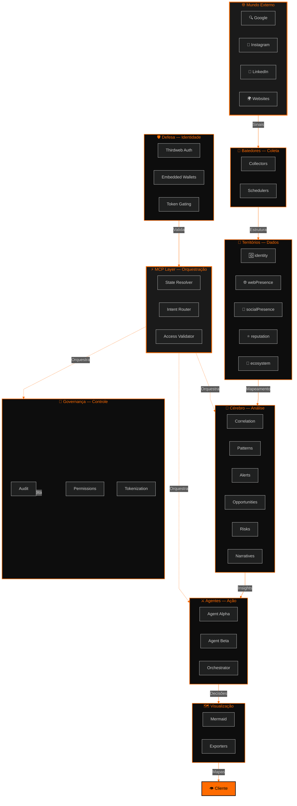
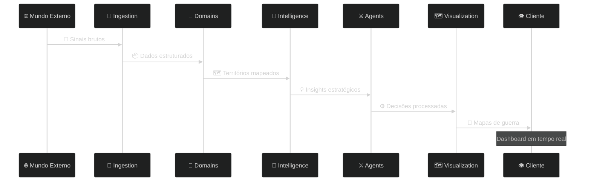
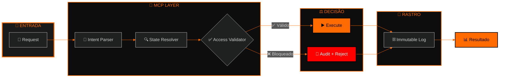
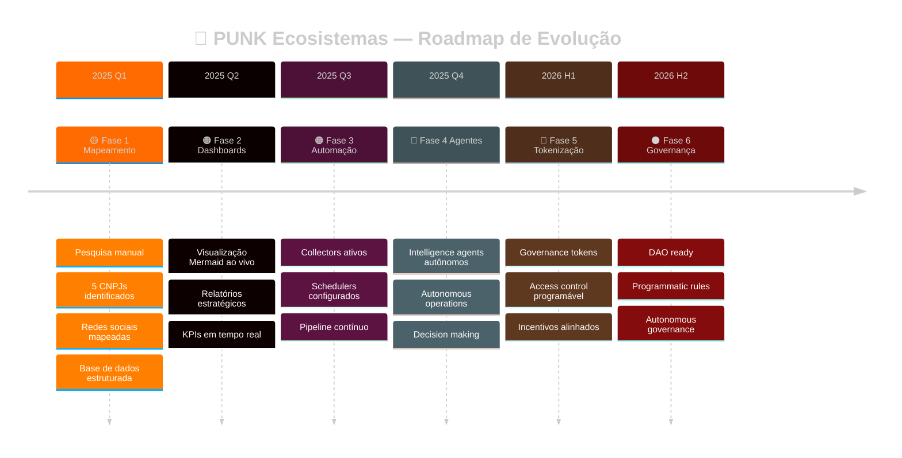
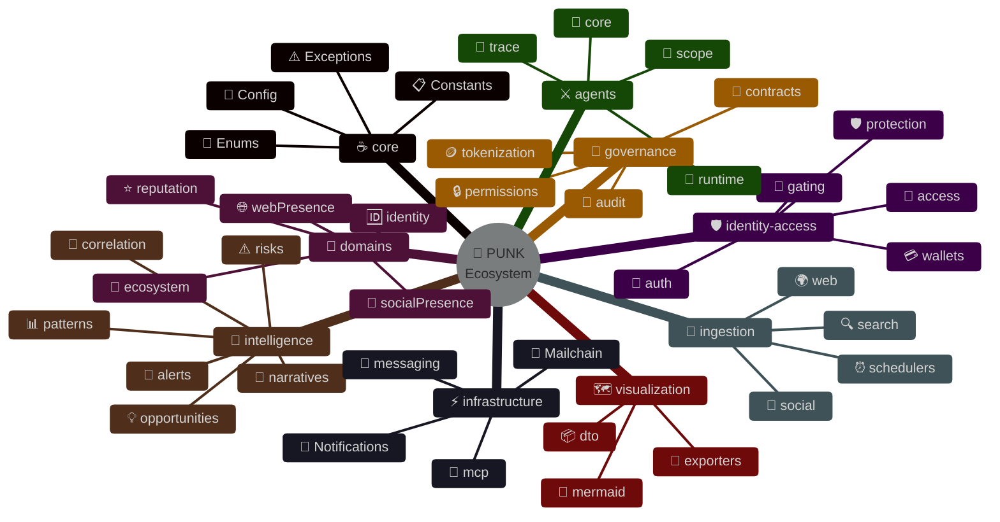
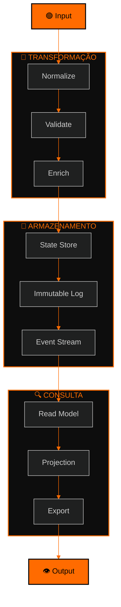
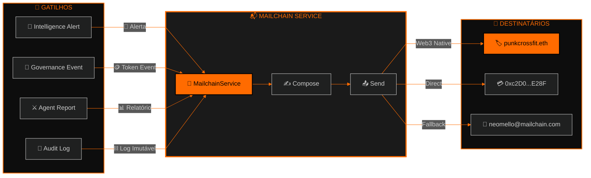

# 🎨 Diagramas do Ecossistema PUNK — Branded

## 1️⃣ Visão Geral da Arquitetura

```mermaid
%%{init: {'flowchart': {'curve': 'linear'}, 'theme': 'dark', 'themeVariables': { 'primaryColor': '#FF6B00', 'primaryTextColor': '#000', 'primaryBorderColor': '#000', 'lineColor': '#FF6B00', 'secondBkgColor': '#1a1a1a', 'tertiaryColor': '#0d0d0d'}}}%%

graph TB
    subgraph EXTERNAL["🌐 Mundo Externo"]
        G["🔍 Google"]
        IG["📸 Instagram"]
        LI["💼 LinkedIn"]
        WEB["🌍 Websites"]   
    end

    subgraph INGESTION["🦅 Batedores — Coleta"]
        IC["Collectors"]
        IS["Schedulers"]
    end

    subgraph DOMAINS["🏰 Territórios — Dados"]
        D1["🆔 identity"]
        D2["🌐 webPresence"]
        D3["📱 socialPresence"]
        D4["⭐ reputation"]
        D5["🔗 ecosystem"]
    end

    subgraph INTELLIGENCE["🧠 Cérebro — Análise"]
        CORR["Correlation"]
        PAT["Patterns"]
        ALERT["Alerts"]
        OPP["Opportunities"]
        RISK["Risks"]
        NAR["Narratives"]
    end

    subgraph AGENTS["⚔️ Agentes — Ação"]
        AG1["Agent Alpha"]
        AG2["Agent Beta"]
        ORCH["Orchestrator"]
    end

    subgraph VIZ["🗺️ Visualização"]
        MERM["Mermaid"]
        EXP["Exporters"]
    end

    subgraph GOVERNANCE["📜 Governança — Controle"]
        AUD["Audit"]
        PERM["Permissions"]
        TOKEN["Tokenization"]
    end

    subgraph ACCESS["🛡️ Defesa — Identidade"]
        TW["Thirdweb Auth"]
        WALLET["Embedded Wallets"]
        GATE["Token Gating"]
    end

    subgraph MCP["⚡ MCP Layer — Orquestração"]
        STATE["State Resolver"]
        INTENT["Intent Router"]
        VAL["Access Validator"]
    end

    EXTERNAL -->|Sinais| INGESTION
    INGESTION -->|Estrutura| DOMAINS
    DOMAINS -->|Mapeamento| INTELLIGENCE
    INTELLIGENCE -->|Insights| AGENTS
    AGENTS -->|Decisões| VIZ
    VIZ -->|Mapas| CLIENT["👁️ Cliente"]

    MCP -.->|Orquestra| AGENTS
    MCP -.->|Orquestra| INTELLIGENCE
    MCP -.->|Orquestra| GOVERNANCE

    ACCESS -->|Valida| MCP
    GOVERNANCE -->|Audita| AUD

    style EXTERNAL fill:#1a1a1a,stroke:#FF6B00,stroke-width:3px,color:#FF6B00
    style INGESTION fill:#0d0d0d,stroke:#FF6B00,stroke-width:2px,color:#FF6B00
    style DOMAINS fill:#0d0d0d,stroke:#FF6B00,stroke-width:2px,color:#FF6B00
    style INTELLIGENCE fill:#0d0d0d,stroke:#FF6B00,stroke-width:2px,color:#FF6B00
    style AGENTS fill:#0d0d0d,stroke:#FF6B00,stroke-width:2px,color:#FF6B00
    style VIZ fill:#0d0d0d,stroke:#FF6B00,stroke-width:2px,color:#FF6B00
    style GOVERNANCE fill:#0d0d0d,stroke:#FF6B00,stroke-width:2px,color:#FF6B00
    style ACCESS fill:#0d0d0d,stroke:#FF6B00,stroke-width:2px,color:#FF6B00
    style MCP fill:#1a1a1a,stroke:#FF6B00,stroke-width:3px,color:#FF6B00
    style CLIENT fill:#FF6B00,stroke:#000,stroke-width:2px,color:#000
```

---

## 2️⃣ Fluxo de Dados — Sequência

```mermaid
%%{init: {'sequenceDiagram': {'mirrorActors': false}, 'theme': 'dark', 'themeVariables': { 'primaryColor': '#FF6B00', 'primaryTextColor': '#000', 'primaryBorderColor': '#000', 'lineColor': '#FF6B00', 'textColor': '#FF6B00'}}}%%

sequenceDiagram
    participant EXT as 🌐 Mundo Externo
    participant ING as 🦅 Ingestion
    participant DOM as 🏰 Domains
    participant INT as 🧠 Intelligence
    participant AGT as ⚔️ Agents
    participant VIZ as 🗺️ Visualization
    participant CLI as 👁️ Cliente

    EXT->>ING: 📡 Sinais brutos
    ING->>DOM: 📦 Dados estruturados
    DOM->>INT: 🗺️ Territórios mapeados
    INT->>AGT: 💡 Insights estratégicos
    AGT->>VIZ: ⚙️ Decisões processadas
    VIZ->>CLI: 🎯 Mapas de guerra
    
    Note over CLI: Dashboard em tempo real
```

---

## 3️⃣ Modelo de Defesa Infinita

```mermaid
%%{init: {'flowchart': {'curve': 'linear'}, 'theme': 'dark', 'themeVariables': { 'primaryColor': '#FF6B00', 'primaryTextColor': '#000', 'primaryBorderColor': '#000', 'lineColor': '#FF6B00'}}}%%

graph LR
    subgraph ENTRY["🚪 ENTRADA"]
        REQ["📨 Request"]
    end

    subgraph MCP["🔐 MCP LAYER"]
        A["🎯 Intent Parser"] --> B["🔍 State Resolver"]
        B --> C{"✅ Access Validator"}
    end

    subgraph DECISION["⚖️ DECISÃO"]
        C -->|✅ Válido| D["▶️ Execute"]
        C -->|❌ Bloqueado| E["🚫 Audit + Reject"]
    end

    subgraph TRACE["📝 RASTRO"]
        D --> F["⛓️ Immutable Log"]
        E --> F
    end

    REQ --> A
    F --> RESULT["📊 Resultado"]

    style ENTRY fill:#1a1a1a,stroke:#FF6B00,stroke-width:3px,color:#FF6B00
    style MCP fill:#0d0d0d,stroke:#FF6B00,stroke-width:2px,color:#FF6B00
    style DECISION fill:#0d0d0d,stroke:#FF6B00,stroke-width:2px,color:#FF6B00
    style TRACE fill:#0d0d0d,stroke:#FF6B00,stroke-width:2px,color:#FF6B00
    style D fill:#FF6B00,stroke:#000,stroke-width:2px,color:#000
    style E fill:#FF0000,stroke:#000,stroke-width:2px,color:#FFF
    style RESULT fill:#FF6B00,stroke:#000,stroke-width:2px,color:#000
```

---

## 4️⃣ Roadmap — Evolução em Ondas

```mermaid
%%{init: {'theme': 'dark', 'themeVariables': { 'primaryColor': '#FF6B00', 'primaryTextColor': '#000', 'primaryBorderColor': '#000', 'lineColor': '#FF6B00', 'tertiaryColor': '#0d0d0d'}}}%%

timeline
    title 🚀 PUNK Ecosistemas — Roadmap de Evolução
    
    section 2025 Q1
        🟡 Fase 1 Mapeamento : Pesquisa manual
                             : 5 CNPJs identificados
                             : Redes sociais mapeadas
                             : Base de dados estruturada
    
    section 2025 Q2
        🟠 Fase 2 Dashboards : Visualização Mermaid ao vivo
                             : Relatórios estratégicos
                             : KPIs em tempo real
    
    section 2025 Q3
        🟠 Fase 3 Automação : Collectors ativos
                            : Schedulers configurados
                            : Pipeline contínuo
    
    section 2025 Q4
        🔴 Fase 4 Agentes : Intelligence agents autônomos
                          : Autonomous operations
                          : Decision making
    
    section 2026 H1
        🔴 Fase 5 Tokenização : Governance tokens
                              : Access control programável
                              : Incentivos alinhados
    
    section 2026 H2
        ⚫ Fase 6 Governança : DAO ready
                            : Programmatic rules
                            : Autonomous governance
```

---

## 5️⃣ Arquitetura de Núcleos — Mind Map

```mermaid
%%{init: {'theme': 'dark', 'themeVariables': { 'primaryColor': '#FF6B00', 'primaryTextColor': '#000', 'primaryBorderColor': '#000', 'noteBkgColor': '#1a1a1a', 'noteBorderColor': '#FF6B00'}}}%%

mindmap
    root((🎯 PUNK<br/>Ecosystem))
        ☕ core
            🔧 Config
            📋 Constants
            🎯 Enums
            ⚠️ Exceptions
        🏰 domains
            🆔 identity
            🌐 webPresence
            📱 socialPresence
            ⭐ reputation
            🔗 ecosystem
        🦅 ingestion
            🔍 search
            📱 social
            🌍 web
            ⏰ schedulers
        🧠 intelligence
            🔀 correlation
            📊 patterns
            🚨 alerts
            💡 opportunities
            ⚠️ risks
            📖 narratives
        🗺️ visualization
            📐 mermaid
            📦 dto
            💾 exporters
        🛡️ identity-access
            🔑 auth
            💳 wallets
            🚪 access
            🔐 gating
            🛡️ protection
        📜 governance
            📝 audit
            🔒 permissions
            🪙 tokenization
            📜 contracts
        ⚔️ agents
            🎯 core
            🏃 runtime
            📍 trace
            📏 scope
        ⚡ infrastructure
            🔗 mcp
            📨 messaging
            📧 Mailchain
            🔔 Notifications
```

---

## 6️⃣ Ciclo de Dados — Estado Imutável

```mermaid
%%{init: {'flowchart': {'curve': 'linear'}, 'theme': 'dark', 'themeVariables': { 'primaryColor': '#FF6B00', 'primaryTextColor': '#000', 'primaryBorderColor': '#000', 'lineColor': '#FF6B00'}}}%%

graph TB
    START["🟢 Input"] 
    
    subgraph TRANSFORM["🔄 TRANSFORMAÇÃO"]
        T1["Normalize"]
        T2["Validate"]
        T3["Enrich"]
    end
    
    subgraph STORE["💾 ARMAZENAMENTO"]
        S1["State Store"]
        S2["Immutable Log"]
        S3["Event Stream"]
    end
    
    subgraph QUERY["🔍 CONSULTA"]
        Q1["Read Model"]
        Q2["Projection"]
        Q3["Export"]
    end
    
    END["👁️ Output"]
    
    START --> T1 --> T2 --> T3
    T3 --> S1
    S1 --> S2
    S2 --> S3
    S3 --> Q1
    Q1 --> Q2
    Q2 --> Q3
    Q3 --> END
    
    style START fill:#FF6B00,stroke:#000,stroke-width:2px,color:#000
    style TRANSFORM fill:#0d0d0d,stroke:#FF6B00,stroke-width:2px,color:#FF6B00
    style STORE fill:#0d0d0d,stroke:#FF6B00,stroke-width:2px,color:#FF6B00
    style QUERY fill:#0d0d0d,stroke:#FF6B00,stroke-width:2px,color:#FF6B00
    style END fill:#FF6B00,stroke:#000,stroke-width:2px,color:#000
```

---

## 7️⃣ Integração Mailchain — Notificações Web3

```mermaid
%%{init: {'flowchart': {'curve': 'linear'}, 'theme': 'dark', 'themeVariables': { 'primaryColor': '#FF6B00', 'primaryTextColor': '#000', 'primaryBorderColor': '#000', 'lineColor': '#FF6B00'}}}%%

graph LR
    subgraph TRIGGERS["🎯 GATILHOS"]
        T1["🧠 Intelligence Alert"]
        T2["📜 Governance Event"]
        T3["⚔️ Agent Report"]
        T4["📝 Audit Log"]
    end

    subgraph MAILCHAIN["📬 MAILCHAIN SERVICE"]
        MC["📨 MailchainService"]
        MC --> COMPOSE["✍️ Compose"]
        COMPOSE --> SEND["📤 Send"]
    end

    subgraph RECIPIENTS["🎯 DESTINATÁRIOS"]
        ENS["🏷️ punkcrossfit.eth"]
        WALLET["💳 0xc2D0...E28F"]
        EMAIL["📧 neomello@mailchain.com"]
    end

    T1 -->|"🚨 Alerta"| MC
    T2 -->|"🪙 Token Event"| MC
    T3 -->|"📊 Relatório"| MC
    T4 -->|"⛓️ Log Imutável"| MC

    SEND -->|"Web3 Native"| ENS
    SEND -->|"Direct"| WALLET
    SEND -->|"Fallback"| EMAIL

    style TRIGGERS fill:#0d0d0d,stroke:#FF6B00,stroke-width:2px,color:#FF6B00
    style MAILCHAIN fill:#1a1a1a,stroke:#FF6B00,stroke-width:3px,color:#FF6B00
    style RECIPIENTS fill:#0d0d0d,stroke:#FF6B00,stroke-width:2px,color:#FF6B00
    style ENS fill:#FF6B00,stroke:#000,stroke-width:2px,color:#000
    style MC fill:#FF6B00,stroke:#000,stroke-width:2px,color:#000
```

---

## 🎨 Paleta de Marca

| Elemento | Cor | Uso |
|----------|-----|-----|
| **Primária** | `#FF6B00` (Laranja) | Highlights, CTAs, destaque |
| **Secundária** | `#000000` (Preto) | Backgrounds, borders, text |
| **Destaque** | `#1a1a1a` (Preto suave) | Subgrupos, containers |
| **Erro** | `#FF0000` (Vermelho) | Bloqueios, rejeições |
| **Sucesso** | `#FF6B00` (Laranja) | Execuções, aceites |

---

**Feito com 🖤 e 🧡 — PUNK Ecosystem**

*Soberania Digital em Preto e Laranja*

