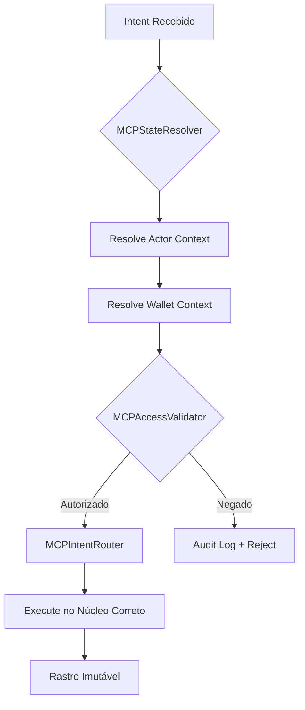

# MCP Architecture

## A Parte Que Poucos Enxergam

MCP não conversa com usuário.
MCP conversa com **estado do sistema**.

## Modelo de Intent

```json
{
  "intent": "ANALYZE_DIGITAL_PRESENCE",
  "actor": "agent:intelligence.alpha",
  "access_level": "strategic",
  "wallet_context": "embedded"
}
```

## Fluxo de Decisão



## Componentes

### MCPStateResolver

Não pergunta: "Esse agente pode?"
Pergunta: "Qual é o estado atual do sistema para este actor?"

### MCPAccessValidator

Valida baseado em:
- Actor identity
- Access level
- Wallet context (embedded/external)
- Current system state

### MCPIntentRouter

Roteia intents para o núcleo correto:

| Intent | Núcleo Destino |
|--------|----------------|
| ANALYZE_* | intelligence/ |
| COLLECT_* | ingestion/ |
| VISUALIZE_* | visualization/ |
| GOVERN_* | governance/ |
| PROTECT_* | identity-access/ |

## Access Levels

```java
enum AccessLevel {
    PUBLIC,      // Dados abertos
    OPERATIONAL, // Execução de tarefas
    STRATEGIC,   // Análise e insights
    SOVEREIGN    // Governança total
}
```

## Wallet Context

```java
enum WalletContext {
    EMBEDDED,    // Thirdweb embedded wallet
    EXTERNAL,    // Wallet conectada externamente
    SYSTEM,      // Operações internas
    ANONYMOUS    // Sem wallet (limitado)
}
```

## Princípio Central

> O backend não pergunta "Esse agente pode?"
> O backend resolve "Qual é o estado atual?" e age conforme.

Estado determina permissão.
Permissão não é pergunta, é cálculo.

---

Author: MELLØ // POST-HUMAN

