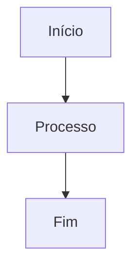
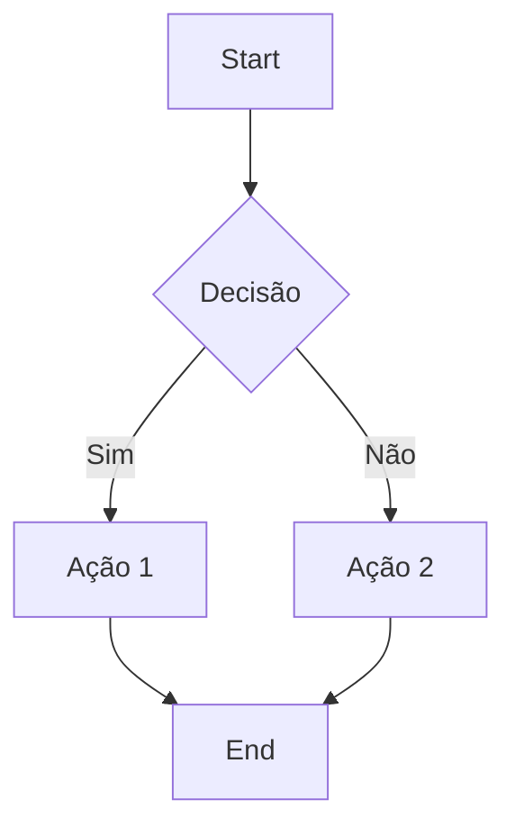
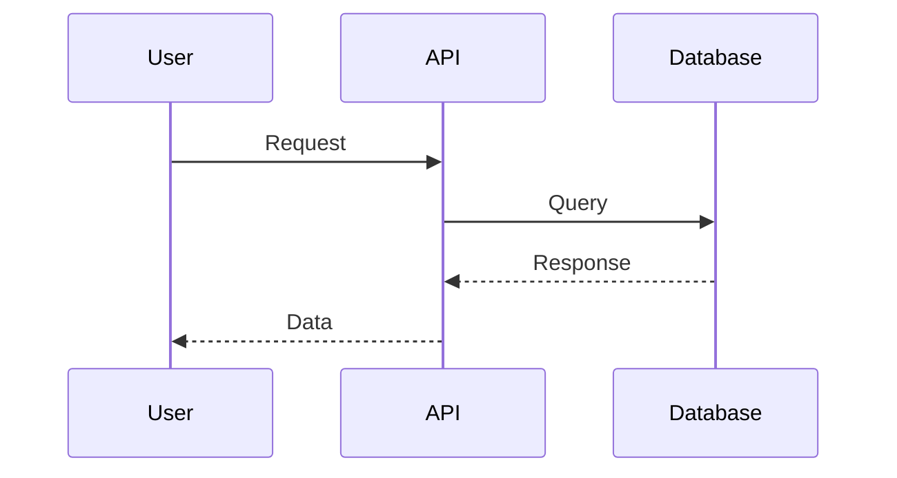
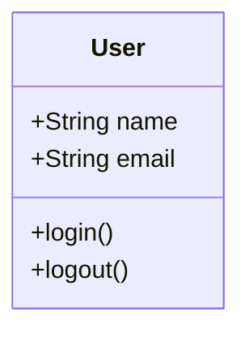
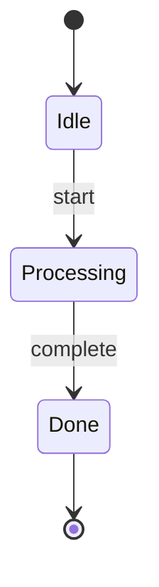
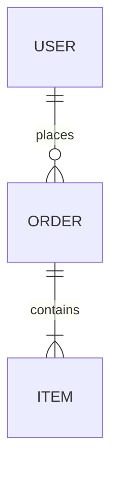
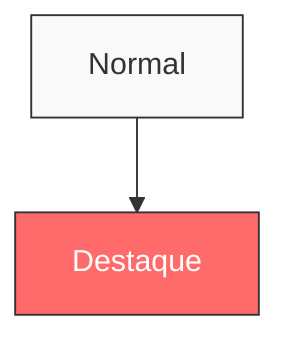

<!-- mermaid rules -->

## Padrões para Diagramas Mermaid

### Sintaxe Básica

Use blocos de código com a linguagem `mermaid`:

````markdown

````

### Tipos de Diagramas

#### Flowchart (Fluxograma)



#### Sequence Diagram (Sequência)



#### Class Diagram (Classes)



#### State Diagram (Estados)



#### ER Diagram (Entidades)



### Boas Práticas

- **Direção**: Use `TD` (top-down) ou `LR` (left-right)
- **Nomes**: Use identificadores curtos (A, B, C) com labels descritivos
- **Cores**: Use classes CSS para destacar elementos importantes
- **Simplicidade**: Mantenha diagramas focados em um conceito

### Estilos Customizados



### Preview no VS Code/Cursor

Instale a extensão:

- **Markdown Preview Mermaid Support** (`bierner.markdown-mermaid`)

Ou use o preview nativo do GitHub (push e visualize no repo).

